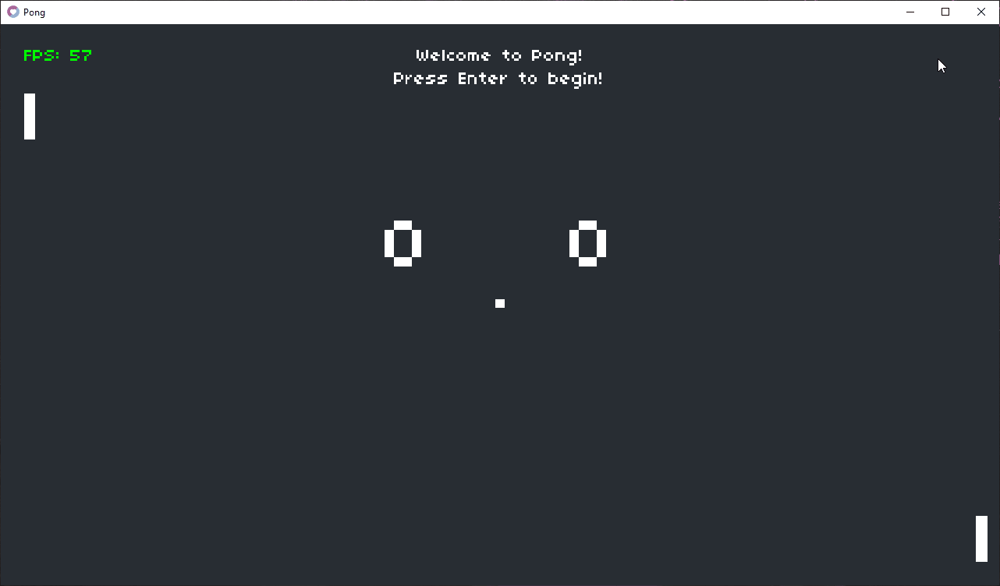

# 🎮 CS50 — Pong

[](https://love2d.org/)
[](https://www.lua.org/)
[](https://cs50.harvard.edu/games/)
[](LICENSE)

**Course:** [CS50's Introduction to Game Development](https://cs50.harvard.edu/games/)  
**Assignment:** Pong  
**Engine / Language:** LÖVE2D (Lua)  

---

## 📋 Project Overview

This repository contains my implementation of the **Pong** assignment from CS50's Introduction to Game Development.

---

### What I implemented:

- ✔️ Added a basic AI to control the **right paddle**, which automatically moves to deflect the ball.
- ✔️ Preserved original paddle controls for the left paddle (W / S keys).
- ✔️ Kept the core game mechanics intact from the original skeleton code.
- ✔️ Ensured smooth gameplay using LÖVE2D framework (Lua).

This AI allows single-player mode where the computer plays against you!

---

## 🎬 Gameplay Preview



---

## 🚀 How to Run

1. Install [LÖVE2D](https://love2d.org/).

2. Clone this repository:

   ```bash
   git clone https://github.com/huzaifa-gamedev/cs50-pong.git
   cd cs50-pong
   ```

3. Run the game:

   ```bash
   love .
   ```

---

## 🎯 Controls

- **W / S** — Move left paddle up/down
- **Up / Down arrow keys** — Move right paddle up/down
- **Enter** — Start game / serve ball
- **Escape** — Quit game

---

## ✨ Credits

- Original skeleton code & assets: CS50's Introduction to Game Development (Harvard). Licensed under [CC BY-NC-SA 4.0](https://creativecommons.org/licenses/by-nc-sa/4.0/).

---

## 📄 License


- This implementation: © 2025 Muhammad Huzaifa Karim. Licensed under the [MIT License](LICENSE).

For more details, see [ATTRIBUTION.md](ATTRIBUTION.md).

---

## ✍️ Author

**Muhammad Huzaifa Karim**
[GitHub Profile](https://github.com/huzaifakarim1)

---

## 📬 Contact

For ideas, feedback, or collaboration, feel free to reach out via [GitHub](https://github.com/huzaifakarim1).


---

© 2025 Muhammad Huzaifa Karim. All rights reserved.
